<p align="center">
  
</p>

# StillAir

A free, open-source macOS menu bar app for **fanless Macs**. Always shows the current temperature. When macOS raises thermal pressure, a 1–5 rank appears beside it, colored yellow to deep red. A persistent log shows when throttling happened.

**[Download the latest release](https://github.com/nsd97/stillair/releases/latest)**

## Why

Fanless Macs (MacBook Air) throttle under sustained load — long builds, multiple simulators, Docker — and there's no fan to hear it. StillAir puts throttling where you can see it: the temperature, the pressure rank, and a log of every level change.

## Features

- **Always-on temperature** in the menu bar (°C / °F)
- **Throttle rank 1–5** beside the temperature when the machine is under pressure (color follows pressure, not °C)
- **Throttle log** — timestamped level changes, so you can see *when* throttling happened
- **Read-only by design** — reads SMC temperatures and Darwin thermal pressure. No fan control, no SMC writes, no privileged helper, no Login Items approval

## Install

1. Grab `StillAir.dmg` from the [latest release](https://github.com/nsd97/stillair/releases/latest)
2. Open the DMG and drag **StillAir** into Applications
3. Launch StillAir — it appears in the menu bar

### Build from source

**Requirements:** macOS 13.0+, Xcode 15+, [XcodeGen](https://github.com/yonaskolb/XcodeGen) (`brew install xcodegen`)

```bash
git clone https://github.com/nsd97/stillair.git
cd stillair
xcodegen generate
open StillAir.xcodeproj   # ⌘R
```

Or:

```bash
xcodebuild -project StillAir.xcodeproj -scheme StillAir -configuration Debug build
```

**Notarized DMG:** `cp .env.example .env` (APPLE_ID, APPLE_APP_SPECIFIC_PASSWORD, APPLE_TEAM_ID), then `./scripts/build-dmg.sh` — builds, signs, notarizes, and publishes a GitHub release.

## How it works

StillAir reads SMC temperatures (the number) and Darwin notify `com.apple.system.thermalpressurelevel` (the 1–5 rank and color). Those are different signals: the OS can throttle while the °C readout still looks "fine."

| Rank | Pressure | Menu bar |
|------|----------|----------|
| 1 | Nominal | `72°` default color |
| 2 | Fair | `72°` yellow |
| 3 | Serious | `72°` orange |
| 4 | Critical | `72°` red |
| 5 | (notify max) | `72°` deep red |

## Credits

StillAir is a **descendant of [ChillMac](https://github.com/idevtim/chillmac)** by [Timothy Murphy](https://github.com/idevtim) (MIT licensed). ChillMac is a full system monitor with fan-speed control for Intel Macs; StillAir keeps the temperature monitoring and drops fan control entirely, reworked for fanless Apple Silicon.

Lineage: `idevtim/chillmac` → `nsd97/chillmac` (Fan Sooner) → `ArchieOS-org/chillmac` (StillAir prototype) → this repository.

See [LICENSE](LICENSE) — the original MIT notice is preserved alongside the StillAir copyright.

## Security

StillAir is an unprivileged menu bar app. It reads SMC temperatures via IOKit and thermal-pressure state via Darwin notify. It does **not** write SMC keys and has **no privileged helper**. See [SECURITY.md](SECURITY.md).
